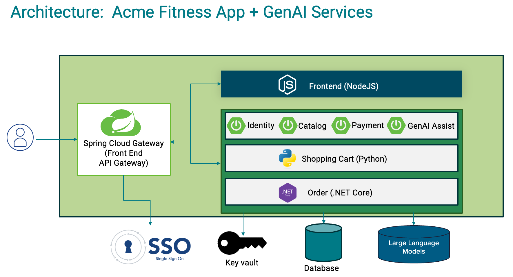

# ACME Fitness Store

ACME Fitness store is a fictional, online sporting goods retail store. This repository contains the source code and
deployment resources for the ACME Fitness store application.

## Architecture



This application is composed of several services:

* 4 Java Spring Boot applications:
  * A catalog service for fetching available products.
  * A payment service for processing and approving payments for users' orders
  * An identity service for referencing the authenticated user
  * An assist service for infusing AI into fitness store

* 1 Python application:
  * A cart service for managing a users' items that have been selected for purchase

* 1 ASP.NET Core applications:
  * An order service for placing orders to buy products that are in the users' carts

* 1 React single-page application (Vite + TypeScript, Tailwind CSS, TanStack Query):
  * A frontend shopping application

The sample can be deployed to Tanzu Platform.

## Repo Organization

| Directory                                 | Purpose                                                                     |
|-------------------------------------------|-----------------------------------------------------------------------------|
| [apps/](./apps)                           | source code for the services                                                |
| [aspire/](./aspire)                       | Aspire app host - local dev orchestration and Cloud Foundry publish/deploy  |
| [e2e/](./e2e)                             | end to end frontend tests                                                   |
| [local-development/](./local-development) | local docker configuration ([documentation](./local-development/README.md)) |

## Deployment

### Aspire (Recommended)

This repo ships a project-based [Aspire](https://aspire.dev/) app host (`aspire/AppHost/`)
that orchestrates all 7 services for local development with a single command, and can publish/push every one of
them - including `cart` and `shopping`, pushed as source via buildpacks, no Docker image involved - straight to
Cloud Foundry.

#### Prerequisites

* .NET 10 SDK and the `aspire` CLI (`aspire --version`) on your `PATH`.
* JDK + the Gradle wrapper (for the four Spring Boot apps), Node.js (for `shopping`), Python (for `cart`) - same as
  today, Aspire doesn't change these.
* Docker (or Podman) running - Aspire launches Postgres, Valkey, Eureka, and Config Server as containers.
* The OpenTelemetry Java agent at `local-development/opentelemetry-javaagent.jar` - download the latest release from
  the [opentelemetry-java-instrumentation releases](https://github.com/open-telemetry/opentelemetry-java-instrumentation/releases/latest/download/opentelemetry-javaagent.jar)
  and place it there.
* The two commercial Tanzu jars in `local-development/spring-enterprise/` (`tanzu-local-authorization-server.jar`,
  `tanzu-spring-cloud-gateway.jar`) - place them manually per
  [local-development/spring-enterprise/README.md](local-development/spring-enterprise/README.md), or set the
  `broadcom-auth-server-jar-url` / `broadcom-gateway-jar-url` user secrets (plus `broadcom-download-token` if your
  portal link needs one) to have the app host download them automatically.

#### Local development

```bash
aspire run
```

Starts the whole graph - Postgres, Valkey, Eureka, and Config Server as containers; the four Spring Boot apps via
Gradle; `cart` and `shopping` directly; the Tanzu Local Authorization Server and commercial Spring Cloud Gateway; and
`order` (.NET) - wires service discovery, config-server registration, local HTTPS cert trust for the Spring apps, and
gateway routing, then opens the Aspire dashboard. Set `openai-api-key` as a user secret if you want `assist`'s AI
features to actually work (it starts fine without one), and optionally `pg-username`/`pg-password` (default to
`user`/`pass`).

#### Foundation configuration

Foundation-specific settings (org, space, gateway URL, etc.) are config-driven, not environment variables, so you
can keep one file per foundation. Create `aspire/AppHost/appsettings.<name>.json` (pick any name - you select it
later via `-e <name>`):

```json
{
  "CloudFoundry": {
    "Org": "<your org>",
    "Space": "<your space>",
    "SystemDomain": "sys.<your foundation domain>"
  },
  "GatewayUrl": "https://acme-fitness.<your apps domain>/",
  "VerifyGatewayTls": true,
  "UaaJwkUrl": "https://<your uaa url>/token_keys"
}
```

Note `Org`/`Space`/`SystemDomain` nest under `CloudFoundry`, while `GatewayUrl`/`VerifyGatewayTls`/`UaaJwkUrl` are
top-level keys - the former are bound by the CF hosting library's own environment config, the latter are read
directly in `AppHost.cs`.

* `GatewayUrl` is identity's SSO redirect URI and the base URL `cart` calls back into - the gateway's real public
  URL once deployed. Required for `aspire publish`/`aspire deploy` - a non-working placeholder here would silently
  produce a broken OAuth2 redirect/launch URL post-deploy, so `AppHost.cs` fails fast instead if it's unset. Not
  needed for local `aspire run`.
* `VerifyGatewayTls` defaults to `true`; set it to `false` only if your foundation's gateway route uses a
  self-signed or internal-CA certificate `cart`'s default trust store won't validate.
* `UaaJwkUrl` (conventionally `<uaa-url>/token_keys`) is required for `aspire publish`/`aspire deploy` - same
  fail-fast reasoning as `GatewayUrl` above. Not needed for local `aspire run` (`identity` validates against the
  local Tanzu Authorization Server instead).

#### Cloud Foundry: `aspire publish` / `aspire deploy`

```bash
aspire publish --publisher cf -o ./aspire-output -e <name>
aspire deploy --publisher cf --non-interactive -e <name>
```

`-e <name>` selects the `appsettings.<name>.json` from [Foundation configuration](#foundation-configuration) above

* with `Org`/`Space` set there, `aspire deploy --non-interactive` no longer needs to prompt for either.

Every service with a `WithDedicatedCloudFoundryServiceInstance(...)` call in `aspire/AppHost/AppHost.cs` (the
service registry, config server, Redis/Valkey cache, and each app's own Postgres database) is created
automatically if missing. Four services aren't modeled as Aspire resources and still need the manual
`cf create-service` calls from the [Create Services](#create-services) step below first: `acme-sso`,
`acme-gateway`, `acme-genai-chat`, and `acme-genai-embed`.

> [!NOTE]
> Route hostnames on a shared domain are unique across the **entire** foundation, not just your space - if
> `acme-fitness` (the example `host` below) is already taken, pick something else when you create `acme-gateway`.

One thing worth knowing about after a deploy:

* `assist` gets its OpenAI configuration automatically from the `acme-genai-chat`/`acme-genai-embed` service
  bindings (via Spring Cloud Bindings) - no manual API key needed on Cloud Foundry.

#### Cloud Foundry: `aspire destroy`

```bash
aspire destroy --non-interactive --yes -e <name>
```

Deletes every app this deploy created, then checks the targeted org/space for any Cloud Foundry service instances
and offers to delete those too - one at a time interactively (drop `--yes` to review and pick individually rather
than deleting everything found). This also works if deployment state is missing (already destroyed, or never
recorded - for example after moving the app host or renaming the environment), falling back to whatever org/space
your `cf` CLI is currently targeting.

### Tanzu Platform for Cloud Foundry (tPCF aka TAS) - Manual / Reference Deployment

*The original from-scratch walkthrough - still useful as a reference, or for foundations without the `aspire` CLI.
See [Aspire (Recommended)](#aspire-recommended) above for the faster path.*

Assumption that the proper Cloud Foundry CLI has been installed.

#### Create Services

```bash
cf create-service p.redis on-demand-cache acme-redis 
cf create-service postgres on-demand-postgres-db acme-catalog-postgres
cf create-service postgres on-demand-postgres-db acme-assist-postgres
cf create-service postgres on-demand-postgres-db acme-order-postgres       

# This sets up your TAS/tPCF config server. It assumes that your config files are located at <this-repository-url> in the branch config (label) under the directory config (searchPaths). You can checkout the branch to see the structure if you like.
cf create-service p.config-server standard acme-config  -c  '{ "git": { "uri": "<this-repository-url>", "label": "config", "searchPaths": "config" } }'

# This assumes Tanzu Single Sign on for TAS/tPCF is installed and configured against UAA.  You can also use other identity providers if you change the plan and binding below.
cf create-service p-identity uaa acme-sso   
cf create-service p.service-registry standard acme-registry  
cf create-service p.gateway standard acme-gateway -c '{"sso": { "plan": "uaa", "scopes": ["openid", "profile", "email"] }, "host": "acme-fitness" ,"cors": { "allowed-origins": [ "*" ] }}'

# This assumes you have a Chat and Embedding model plan configured with Tanzu AI Services v10.3.5 or later
cf create-service ai-models <CHAT MODEL PLAN> acme-genai-chat
cf create-service ai-models <EMBED MODEL PLAN> acme-genai-embed
```

#### Identity Service

```bash
cd acme-identity
./gradlew assemble
cf push --no-start
cf bind-service acme-identity acme-registry

# Replace [YOUR APPS DOMAIN] with your TPCF's apps domain for the gateway
cf bind-service acme-identity acme-sso -c '{  "grant_types": ["authorization_code"],
    "scopes": ["openid"],
    "authorities": ["openid"],
    "redirect_uris": ["https://acme-fitness.[YOUR APPS DOMAIN]/"],
    "auto_approved_scopes": ["openid"],
    "identity_providers": ["uaa"],
    "show_on_home_page": false}'
 
cf bind-service acme-identity acme-gateway -c identity-routes.json
cf start acme-identity

```

#### Cart Service

```bash
cd ../acme-cart
cf push --no-start
cf bind-service acme-cart acme-gateway -c cart-routes.json
cf start acme-cart
```

#### Payment Service

```bash
cd ../acme-payment
./gradlew assemble
cf push --no-start
cf bind-service acme-payment acme-gateway -c payment-routes.json
cf start acme-payment
```

#### Catalog Service

```bash
cd ../acme-catalog
./gradlew clean assemble
cf push --no-start
cf bind-service acme-catalog acme-gateway -c catalog-routes.json
cf start acme-catalog
```

#### Acme Assist

```bash
cd ../acme-assist
./gradlew clean assemble

# Use this with GenAI 0.6+
cf push --no-start 
cf add-network-policy acme-assist acme-catalog
cf bind-service acme-assist acme-gateway -c assist-routes.json
cf start acme-assist
```

#### Order Service

```bash
cd ../acme-order
dotnet publish -r linux-x64
cf push --no-start
cf add-network-policy acme-order acme-payment
cf bind-service acme-order acme-gateway -c order-routes.json
cf start acme-order
```

#### Shopping Service

```bash
cd ../acme-shopping-react
npm install
npm run build
cf push --no-start
cf bind-service acme-shopping acme-gateway -c frontend-routes.json
cf start acme-shopping
```

> [!NOTE]  
> Ensure that the environment variable for TAS has `SPRING_MVC_STATIC_PATH_PATTERN: /static/images/**` set. Currently,
> there is an issue with the value taken from config server being overwritten.

#### tPCF Development Tricks

##### Connecting to Database

<https://docs.cloudfoundry.org/devguide/deploy-apps/ssh-services.html>

`cf ssh -L 65432:{host-of-database-on-TAS}:5432 {application-name}`
