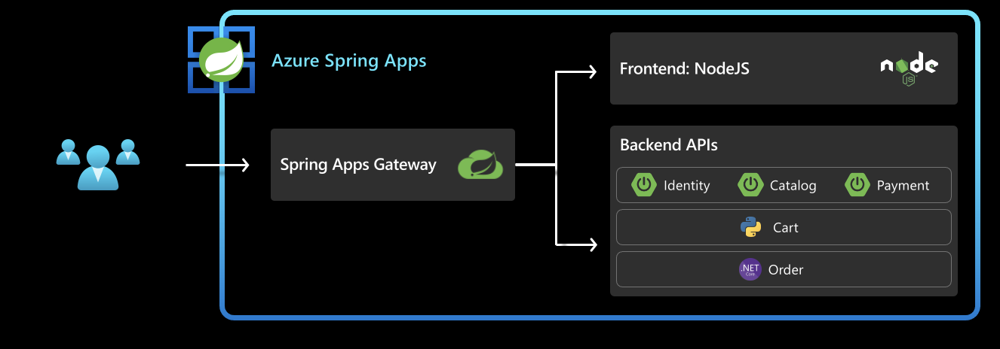
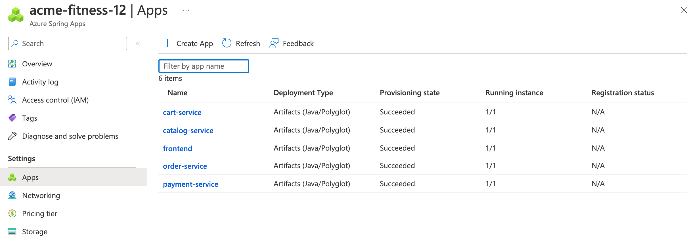

In this section we are going to deploy the backend apps for acme-fitness application. We also updates the rules for these backend apps in Spring Cloud Gateway and configure these apps to talk to Application Config Service and Service Registry.

This diagram below shows the final result once this section is complete:


Below are the different steps that we configure/create to successfully deploy the services/apps
- [1. Create Application Configuration Service](#1-create-application-configuration-service)
- [2. Create backend apps](#2-create-backend-apps)
- [3. Configure apps to Application Configuration Service](#3-configure-apps-to-application-configuration-service)
- [4. Bind apps to Service Registry](#4-bind-apps-to-service-registry)
- [5. Create  routing rules for the backend apps:](#5-create--routing-rules-for-the-backend-apps)
- [6. Deploy backend apps](#6-deploy-backend-apps)
- [7. Test the Application](#7-test-the-application)
- [8. Explore the API using API Portal](#8-explore-the-api-using-api-portal)

##  1. Create Application Configuration Service

Before we can go ahead and point the services to config stored in an external location, we first need to create an application config instance pointing to that external repo. In this case we are going to create an application config instance that points to a github repo using azure cli.

```shell
az spring application-configuration-service git repo add --name acme-fitness-store-config \
    --label main \
    --patterns "catalog/default,catalog/key-vault,identity/default,identity/key-vault,payment/default" \
    --uri "https://github.com/Azure-Samples/acme-fitness-store-config"
```

## 2. Create backend apps

First step is to create an application for each service:

```shell
az spring app create --name ${CART_SERVICE_APP} --instance-count 1 --memory 1Gi &
az spring app create --name ${ORDER_SERVICE_APP} --instance-count 1 --memory 1Gi &
az spring app create --name ${PAYMENT_SERVICE_APP} --instance-count 1 --memory 1Gi &
az spring app create --name ${CATALOG_SERVICE_APP} --instance-count 1 --memory 1Gi &
wait
```
If the above step is successfully complete, you should see all the backend apps listed in your ASA-E instance as below..



## 3. Configure apps to Application Configuration Service

Now the next step is to bind the above created application configuration service instance to the azure apps that use this external config:


```shell
az spring application-configuration-service bind --app ${PAYMENT_SERVICE_APP} &
az spring application-configuration-service bind --app ${CATALOG_SERVICE_APP} &
wait
```

## 4. Bind apps to Service Registry

Applications need to communicate with each other. As we learnt in [section before](../07-asa-e-components-overview/service-registry/README.md) ASA-E internally uses Tanzu Service Registry for dynamic service discovery. To achieve this, required services/apps need to be bound to the service registry using the commands below: 

```shell
az spring service-registry bind --app ${PAYMENT_SERVICE_APP}
az spring service-registry bind --app ${CATALOG_SERVICE_APP}
```

So far in this section we were able to successfully bind backend apps to Application Config Service and Service Registry. 

## 5. Create  routing rules for the backend apps:

Routing rules bind endpoints in the request to the backend applications. For example in the Cart route below, the routing rule indicates any requests to /cart/** endpoint gets routed to backend Cart App.

```shell
az spring gateway route-config create \
    --name ${CART_SERVICE_APP} \
    --app-name ${CART_SERVICE_APP} \
    --routes-file ./resources/json/routes/cart-service.json
    
az spring gateway route-config create \
    --name ${ORDER_SERVICE_APP} \
    --app-name ${ORDER_SERVICE_APP} \
    --routes-file ./resources/json/routes/order-service.json

az spring gateway route-config create \
    --name ${CATALOG_SERVICE_APP} \
    --app-name ${CATALOG_SERVICE_APP} \
    --routes-file ./resources/json/routes/catalog-service.json

```

This completes successful deployments of all the backend apps and updating the rules for these apps in SCG.
## 6. Deploy backend apps

Now that all the required apps are created, the next step is to go ahead and deploy the services/apps. For this we need access to the source code for the services. 

```shell
# Deploy Payment Service
az spring app deploy --name ${PAYMENT_SERVICE_APP} \
    --config-file-pattern payment/default \
    --source-path ../apps/acme-payment \
    --build-env BP_JVM_VERSION=17

# Deploy Catalog Service
az spring app deploy --name ${CATALOG_SERVICE_APP} \
    --config-file-pattern catalog/default \
    --source-path ../apps/acme-catalog \
    --build-env BP_JVM_VERSION=17

# Deploy Order Service
az spring app deploy --name ${ORDER_SERVICE_APP} \
    --source-path ../apps/acme-order 

# Deploy Cart Service 
az spring app deploy --name ${CART_SERVICE_APP} \
    --env "CART_PORT=8080" \
    --source-path ../apps/acme-cart 
```

So far in this section we were able to successfully create and deploy the apps into an existing azure spring apps instance. 

## 7. Test the Application

Now that all the required apps are deployed, you should be able to open the home page and access through the app. You should be able to browse through the catalog and view the different products.

**You will not be able to submit any orders at this point as SSO is not enabled.**

## 8. Explore the API using API Portal

Create API portal and assign an endpoint to API Portal and open it in a browser:

```shell
az spring api-portal create
az spring api-portal update --assign-endpoint true
export PORTAL_URL=$(az spring api-portal show --query properties.url --output tsv)

echo "https://${PORTAL_URL}"
```


⬅️ Previous guide: [03 - HOL 2 - Deploy Acme Fitness frontend App](../03-hol-2-deploy-frontend-app/README.md)

➡️ Workshop Start: [05 - Optional Logging/Monitoring](../05-hol-4-logging-monitoring(optional)/README.md)
